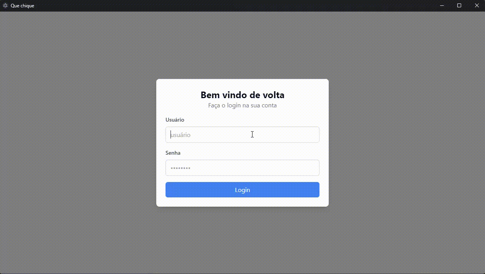
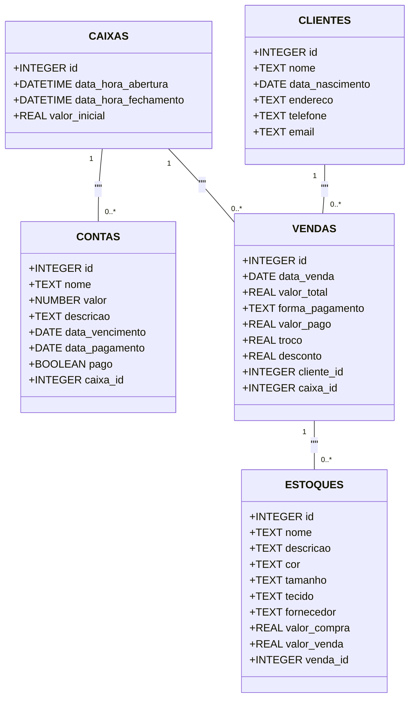

<h1 align="center">
  Inventory Management - Que Chique
</h1>

<p align="center">
  
  
  
  
  
  
  
</p>

This is an inventory management and account registration system designed to facilitate the management of a business, with this prototype tailored for a bazaar. It allows users to efficiently and securely create, update, and delete accounts, customers, inventory, and cash management

[click here](./README.pt-br.md) to see the documentation in Portuguese :brazil:

## Demonstration



## Tecnologies

- [TypeScript](https://www.typescriptlang.org/)
- [Vite](https://vitejs.dev/)
- [React](https://reactjs.org/)
- [React Hook Form](https://react-hook-form.com/)
- [Electron](https://www.electronjs.org/)
- [Electron Forge](https://www.electronforge.io/)
- [Tailwind CSS](https://tailwindcss.com/)
- [Shadcn](https://ui.shadcn.com/)
- [TanStack React Query](https://tanstack.com/query)
- [TanStack React Router](https://tanstack.com/router)
- [TanStack React Table](https://tanstack.com/table)
- [Better SQLite3](https://github.com/JoshuaWise/better-sqlite3)
- [Zod](https://zod.dev/)

## Application Proposal

Create a desktop application for managing accounts payable, clients, and inventory. It should include a tab for daily cash management, allowing users to record sales of inventory items, either linking or not linking the sale to the client who purchased the item. The application should display a daily cash statement and have the capability to generate an Excel report detailing the sales made, along with information on the products and registered clients.

For data persistence, SQLite3 was used with the Better SQLite3 library, and migrations included in the code are executed each time the application is opened.

The class diagram for the completed project looks like this:



Since the aim of the project was not an in-depth study of authentication, a simple method was used, storing data directly in the auth.tsx file with the username admin and password admin. The tanstack react router functions and session storage were used for login validation.

## How to Run

To install and run this project locally, simply clone the Git repository:

```bash
git clone https://github.com/BrunoMedeiros14/ElectronQueChique.git
cd ElectronQueChique
```

- With the **node** in version `20.x.x` and **npm** instaled in machine, install the global `yarn` with the command `npm i -g yarn` and install the dependencies with `yarn install` and then will be possible to execute all of the commands listed bellow:

- To execute the code in dev mode:

  ```bash
  yarn start
  ```

- To package the project:

  ```bash
  yarn package
  ```

- To generate the application installer:

  ```bash
  yarn make
  ```
