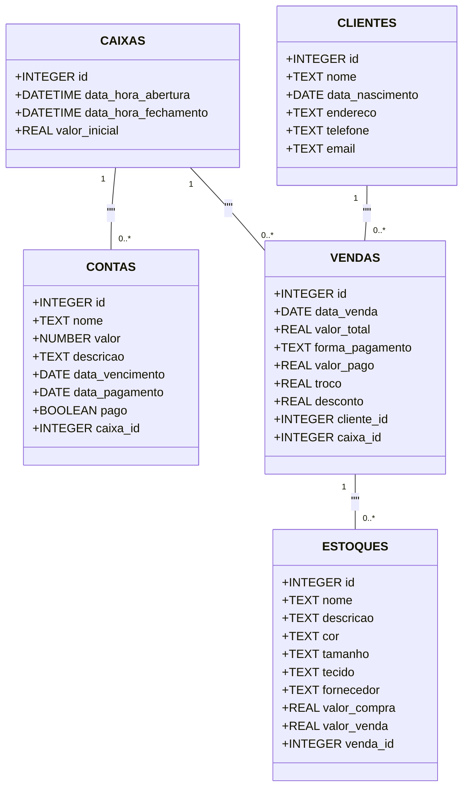

<h1 align="center">
  Gerenciamento de Estoque - Que Chique
</h1>

<p align="center">
  
  
  
  
  
  
  
</p>

Este é um sistema de gerenciamente de estoque e cadastro de contas desenvolvido para facilitar o gerenciamento de um comércio, sendo este protótipo voltado para um bazar. Ele permite que os usuários criem, atualizem e excluam contas, clientes, estoques, caixa de forma eficiente e segura.

## Demonstração


## Tecnologias

- [TypeScript](https://www.typescriptlang.org/)
- [Vite](https://vitejs.dev/)
- [React](https://reactjs.org/)
- [React Hook Form](https://react-hook-form.com/)
- [Electron](https://www.electronjs.org/)
- [Electron Forge](https://www.electronforge.io/)
- [Tailwind CSS](https://tailwindcss.com/)
- [Shadcn](https://ui.shadcn.com/)
- [TanStack React Query](https://tanstack.com/query)
- [TanStack React Router](https://tanstack.com/router)
- [TanStack React Table](https://tanstack.com/table)
- [Better SQLite3](https://github.com/JoshuaWise/better-sqlite3)
- [Zod](https://zod.dev/)

## Proposta de aplicativo

Criar um aplicativo desktop para o cadastro de contas a pagar, clientes e de estoque, incluíndo a aba para o gerenciamento do caixa diário que é possível cadastrar a venda de um estoque vinculando ou não o cliente que comprou este item, mostrando o extrato do caixa diário e tendo a possibilidade de gerar um extrato em excel para retornar as vendas realizadas, junto aos produtos e clientes cadastrados.

Para a persistência dos dados foi utilizado o sqlite3 com a biblioteca Better Sqlite 3 e utilizando migrations incluídas no próprio código que é executada sempre ao abrir o aplicativo.

O diagrama de classes para o projeto finalizado ficou assim:



Como intuito do projeto não era um estudo aprofundado de autenticação, foi utilizado um método simples, persistindo os dados em código no arquivo `auth.tsx` com sendo o usuário `admin` e senha `admin`, utilizando as funções fornecidas pelo `tanstack react router` e o `session storage` para realizar a validação de login.

## Como Executar

Para instalar e executar este projeto localmente, basta clonar o repositório git:

```bash
git clone https://github.com/BrunoMedeiros14/ElectronQueChique.git
cd ElectronQueChique
```

- Com o **node** na versão `20.x.x` e **npm** instalado na máquina, instale o yarn globalmente com o comando `npm i -g yarn` e instale as dependências com `yarn install` e será possível executar os comandos abaixo como desejado:

- Para executar o código:

  ```bash
  yarn start
  ```

- Para empacotar o projeto:

  ```bash
  yarn package
  ```

- Para gerar o instalador do aplicativo:

  ```bash
  yarn make
  ```
